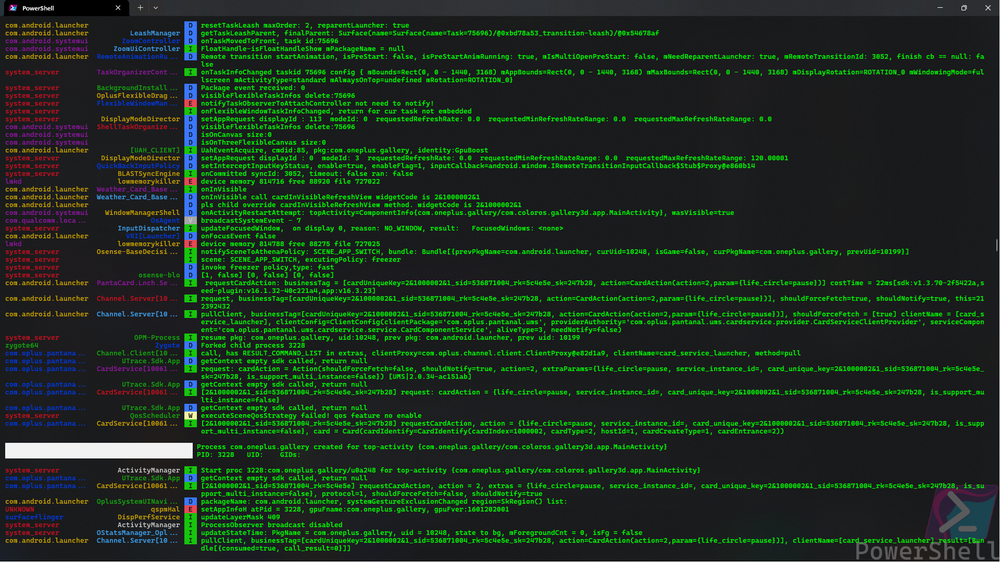
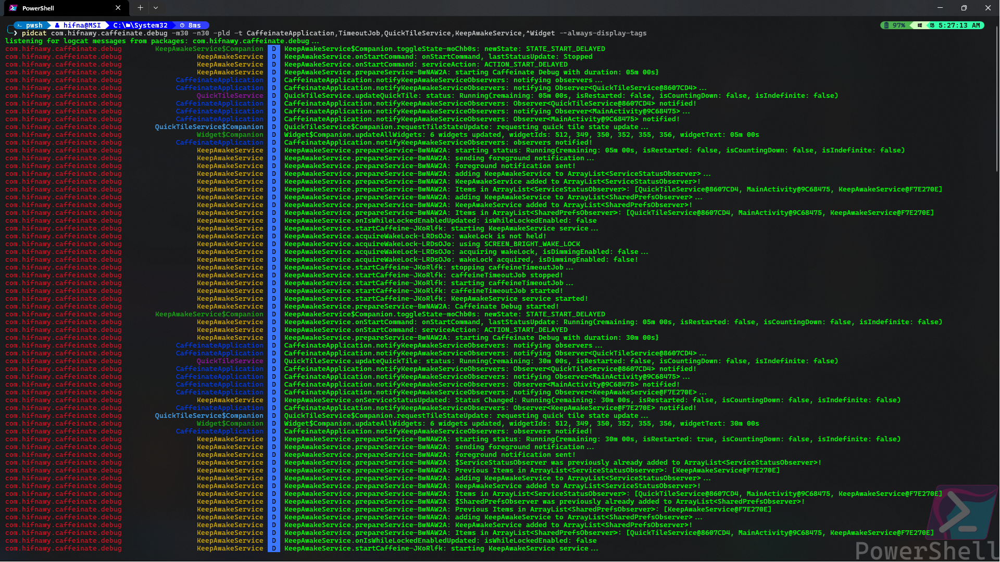

<div align="center">
   
   <h1>📃 PidCat Rust</h1>
   <p>A colorized Android logcat viewer for Windows with advanced filtering capabilities</p>

[](LICENSE.md)
[](https://rust-lang.org)

<!-- [](https://winstall.app/apps/AbdElMoniemElHifnawy.PidCatRust) -->

[](https://github.com/abdalmoniem/pidcat_rust)
[](https://github.com/abdalmoniem/pidcat_rust/releases/latest)
[](https://github.com/abdalmoniem/pidcat_rust/releases/latest)

</div>

# 🎯 Overview

A fork of [PidCat](https://github.com/abdalmoniem/pidcat) re-written entirely in [Rust](https://rust-lang.org)

PidCat is an enhanced Android logcat viewer originally created by Jake Wharton for the Android Open Source Project. This Windows-optimized fork adds modern features including VT100 color support, advanced tag filtering with substring matching, and improved column formatting.

PidCat filters logcat output by application package name, colorizes the output for better readability, and provides powerful filtering options to help you focus on the logs that matter.

---

# 📸 Screenshots

<div align=center>
    
    <br/>
    <br/>
    <br/>
    
</div>

---

# ✨ Features

- ## Core Features

  - 🎨 **Colorized Output** - Different colors for log levels, tags, and packages
  - 📦 **Package Filtering** - Show logs only from specific app packages
  - 🏷️ **Tag Filtering** - Filter by log tags with substring matching support
  - 🔍 **Regex Support** - Use regular expressions for advanced tag filtering
  - 📊 **Process Tracking** - Automatically tracks process starts and deaths
  - 💻 **Windows VT100 Support** - Native color support on Windows 10/11

- ## Advanced Filtering

  - **Multiple Tag Support** - Filter by multiple tags simultaneously
  - **Substring Matching** - Match tags containing specific strings (e.g., `-t Timeout` matches `TimeoutJob$update`)
  - **Regex Patterns** - Use regex special characters for complex filtering
  - **Comma-Separated Tags** - Specify multiple tags in a single argument: `-t Tag1,Tag2,Tag3`
  - **Tag Ignoring** - Exclude specific tags from output with `-i`
  - **Log Level Filtering** - Show only logs at or above a specific level

- ## Display Options

  - **Customizable Column Widths** - Adjust package name and tag column widths
  - **Smart Tag Display** - Automatically shows tags when filtering
  - **Truncation** - Long tags are truncated to fit column width
  - **Process Notifications** - Visual indicators for process lifecycle events

- ## Output Options

  - **File Output** - Save logs to a file with `-o`
  - **Color Disable** - Remove colors for piping or parsing with `-n`
  - **Current App Mode** - Automatically filter by the currently running app

---

# 📥 Installation

- ### Installer Binaries

  [](https://github.com/abdalmoniem/pidcat_rust/releases/latest)
  <!-- [](https://winstall.app/apps/AbdElMoniemElHifnawy.PidCatRust) -->

  <!-- ```bash
  winget install --id AbdElMoniemElHifnawy.PidCatRust
  ``` -->

- ## From Source

  - ### Prerequisites

    - [Android SDK](https://developer.android.com/tools/releases/platform-tools#downloads) with ADB in PATH
    - [Rust](https://rust-lang.org/learn/get-started) latest version
    - [Git](https://git-scm.com) for version control

  - ### Installation Steps

    ```bash
    # Clone the repository
    git clone https://github.com/abdalmoniem/pidcat_rust.git
    cd pidcat_rust

    # Install cargo-make
    cargo install cargo-make

    # Build all variants
    cargo make build-all

    # Run debug variant
    cargo run -- com.example.app

    # Run release variant
    cargo run --release -- com.example.app
    ```

---

# 🚀 Usage

- ## Basic Usage

```bash
# Filter logs by package name
pidcat com.example.myapp

# Filter by multiple packages
pidcat com.example.app1 com.example.app2

# Show all logs (no package filtering)
pidcat -a

# Filter by currently running app
pidcat --current
```

- ## Advanced Filtering

```bash
# Filter by specific tags
pidcat com.example.app -t MyTag -t AnotherTag

# Filter by tags with substring matching
pidcat com.example.app -t Timeout
# Matches: TimeoutJob, TimeoutJob$update, NetworkTimeout, etc.

# Use comma-separated tags
pidcat com.example.app -t MyTag,AnotherTag,ThirdTag

# Combine with log level filtering
pidcat com.example.app -t MyTag -l D
# Shows only Debug level and above

# Ignore specific tags
pidcat com.example.app -i ChattyCrap -i Noisy

# Use regex for complex patterns
pidcat com.example.app -t "^Network.*"
# Matches: NetworkManager, NetworkClient, etc.
```

- ## Command Line Options

```bash
positional arguments:
  package(s)            Application package name(s)
                        This can be specified multiple times

options:
  -h, --help            Show this help message and exit.
  -v, --version         Print the version number and exit
  -a, --all             Print log messages from all packages, default: False
  -k, --keep            Keep the entire log before running, default: False
  -d, --device          Use first device for log input, default: False
  -e, --emulator        Use first emulator for log input, default: False
  -g, --color-gc        Color garbage collection, default: False
  -N, --no-color        Disable colors, default: False
  -P, --show-pid        Show package name in output, default: False
  -p, --show-package    Show package name in output, default: False
  -S, --always-show-tags
                        Always show the tag name, default: False
  -c, --current         Filter logcat by current running app(s), default: False
  -I, --ignore-system-tags
                        Filter output by ignoring known system tags, default: False
                        Use --ignore-tag to ignore additional tags if needed
  -t, --tag TAG         Filter output by specified tag(s)
                        This can be specified multiple times, or as a comma separated list
  -i, --ignore-tag IGNORED_TAG
                        Filter output by ignoring specified tag(s)
                        This can be specified multiple times, or as a comma separated list
  -l, --log-level LEVEL [V|D|I|W|E|F|v|d|i|w|e|f]
                        Filter messages lower than minimum log level, default: V
  -r, --regex REGEX     Filter output messages using the specified REGEX
  -x, --pid-width X     Width of PID column, default: 6
  -n, --package-width N
                        Width of package/process name column, default: 20
  -m, --tag-width M     Width of tag column, default: 20
  -s, --serial DEVICE_SERIAL
                        Device serial number
  -o, --output FILE_PATH
                        Output filename
```

---

# 📚 Examples

<details>

<summary>Example 1: Basic Package Filtering</summary>

```bash
pidcat com.example.myapp
```

Shows all logs from `com.example.myapp` with colorized output.

</details>

<details>

<summary>Example 2: Multiple Tags with Custom Width</summary>

```bash
pidcat com.example.myapp -t Network -t Database -m 25 -n 30
```

Shows logs with `Network` or `Database` tags, with 30-char package column and 25-char tag column.

</details>

<details>

<summary>Example 3: Debug Level Only</summary>

```bash
pidcat com.example.myapp -l D
```

Shows only Debug, Info, Warning, Error, and Fatal logs (filters out Verbose).

</details>

<details>

<summary>Example 4: Save to File Without Colors</summary>

```bash
pidcat com.example.myapp -o logs.txt -n
```

Saves logs to `logs.txt` without color codes.

</details>

<details>

<summary>Example 5: Current App with Specific Tags</summary>

```bash
pidcat --current -t MainActivity -t ServiceManager --always-display-tags
```

Monitors the currently running app, showing only MainActivity and ServiceManager tags.

</details>

<details>

<summary>Example 6: Complex Regex Filtering</summary>

```bash
pidcat com.example.myapp -t "^(Network|Http).*Client$"
```

Matches tags like `NetworkClient`, `HttpClient`, `NetworkSocketClient`, etc.

</details>

<details>

<summary>Example 7: Ignore Verbose Tags</summary>

```bash
pidcat com.example.myapp -i Chatty -i Verbose -l I
```

Shows Info level and above, ignoring tags containing "Chatty" or "Verbose".

</details>

---

# 🔨 Building from Source

- ## Prerequisites

  - [Android SDK](https://developer.android.com/tools/releases/platform-tools#downloads) with ADB in PATH
  - [Rust](https://rust-lang.org/learn/get-started) latest version
  - [Git](https://git-scm.com) for version control
  - [Inno Setup](https://jrsoftware.org/isdl.php) for Windows installer

- ## Build Steps

  - ### Update Version

    - Edit `Cargo.toml` and set the `version` variable

  - ### Run Build Task

    ```bash
    cargo make build-all
    ```

    or

    ```bash
    cargo make rebuild-installer
    ```

  - ### Output Locations
    - **Debug Executable**: `target/debug/PidCat.exe`
    - **Release Executable**: `target/release/PidCat.exe`
    - **Installer**: `build/setup/Output/PidCat_<datetime>.exe`

---

# ⚙️ Configuration

- ## Tag Filtering Behavior

  By default, tag filters use **_substring matching_**:

  ```bash
  -t Timeout
  ```

  Matches any tag containing "Timeout": `TimeoutJob`, `NetworkTimeout`, `TimeoutManager`, etc.

  To use **_exact matching_** or **_regex patterns_**, include regex special characters:

  ```bash
  -t "^TimeoutJob$"  # Exact match only
  -t "Timeout.*Job"  # Regex pattern
  ```

- ## Column Width Adjustment

  Adjust column widths to fit your terminal:

  ```bash
  pidcat com.example.app -m 25 -n 30
  ```

  - Package column: 25 characters
  - Tag column: 30 characters
  - Packages/Tags longer than width are truncated

- ## Color Customization

  Colors are automatically allocated to tags and packages using an LRU cache. Predefined colors exist for common Android tags like `ActivityManager`, `DEBUG`, etc.

---

# 🤝 Contributing

Contributions are welcome! Here's how you can help:

- ## Fork the Repository
- ## Create a Feature Branch
  ```bash
  git checkout -b feature/amazing-feature
  ```
- ## Commit Your Changes
  ```bash
  git commit -m 'Add some amazing feature'
  ```
- ## Push to the Branch
  ```bash
  git push origin feature/amazing-feature
  ```
- ## Open a Pull Request

- ## Development Guidelines

  - Add comments for complex logic
  - Test on Windows 10/11
  - Update documentation for new features

---

# 📄 License

This project is licensed under the GNU General Public License 3.0 - see the [LICENSE](LICENSE.md) file for details.

---

# 🙏 Credits

- ## Original Author

  - **[Jake Wharton](https://github.com/JakeWharton)** - Original [PidCat](https://github.com/JakeWharton/pidcat) creator

- ## Windows Fork Maintainer

  - **AbdElMoniem ElHifnawy** - Windows optimizations and enhancements
  - GitHub: [@abdalmoniem](https://github.com/abdalmoniem)
  - Website: [abdalmoniem-alhifnawy.is-a.dev](https://abdalmoniem-alhifnawy.is-a.dev)

- ## Contributors

  Thanks to all contributors who have helped improve PidCat!

---

<div align="center">

**Made with ❤️ for Android Developers**

If you find PidCat useful, please ⭐ star the repository!

</div>
