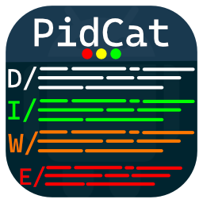
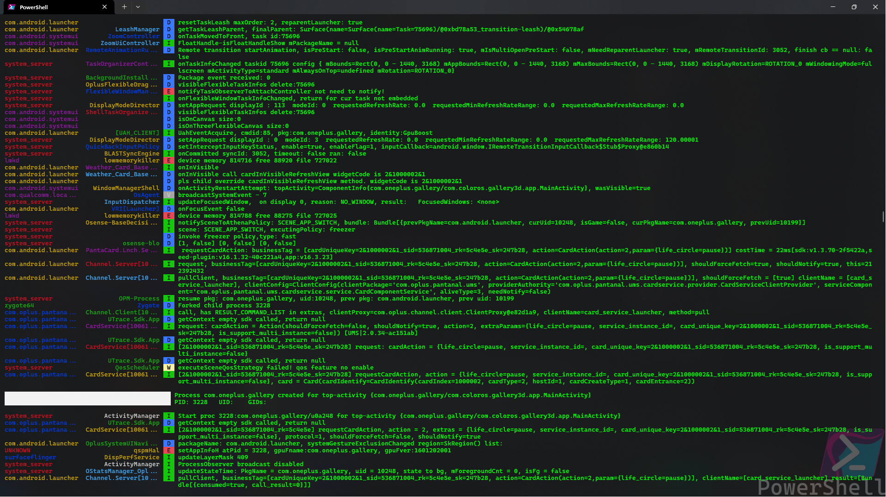
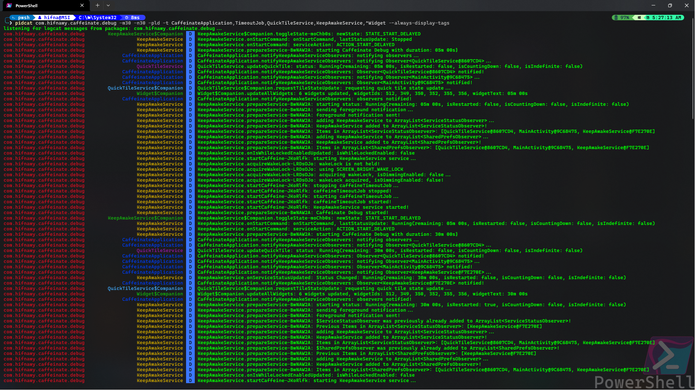
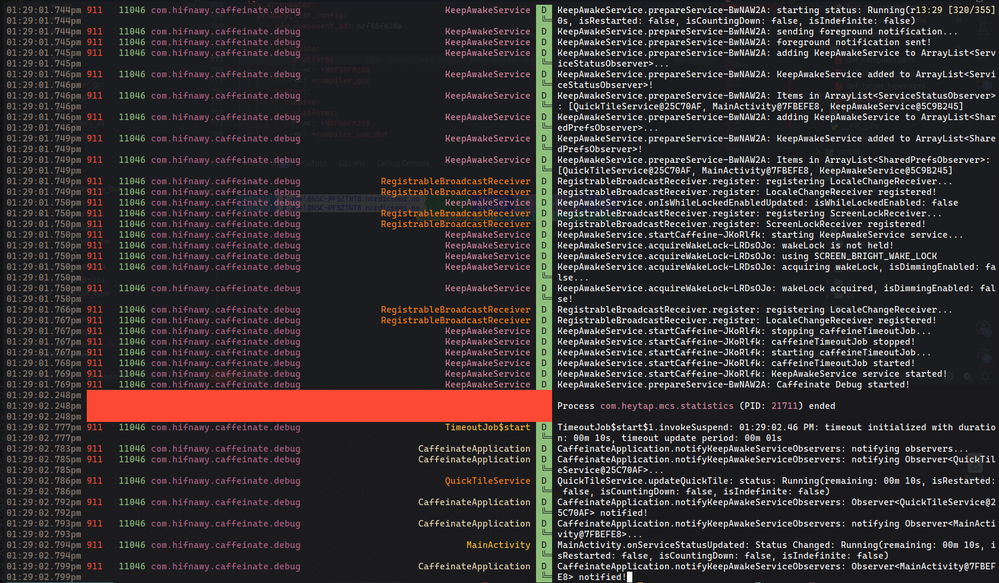
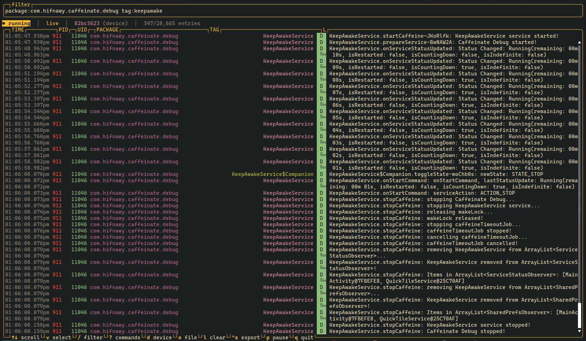
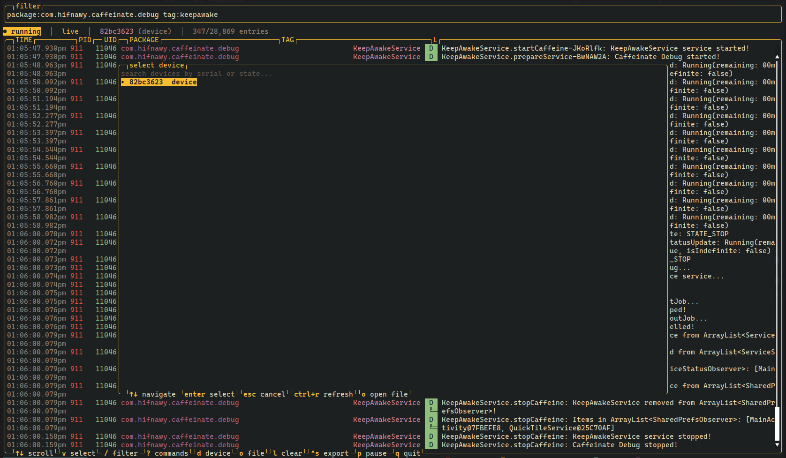
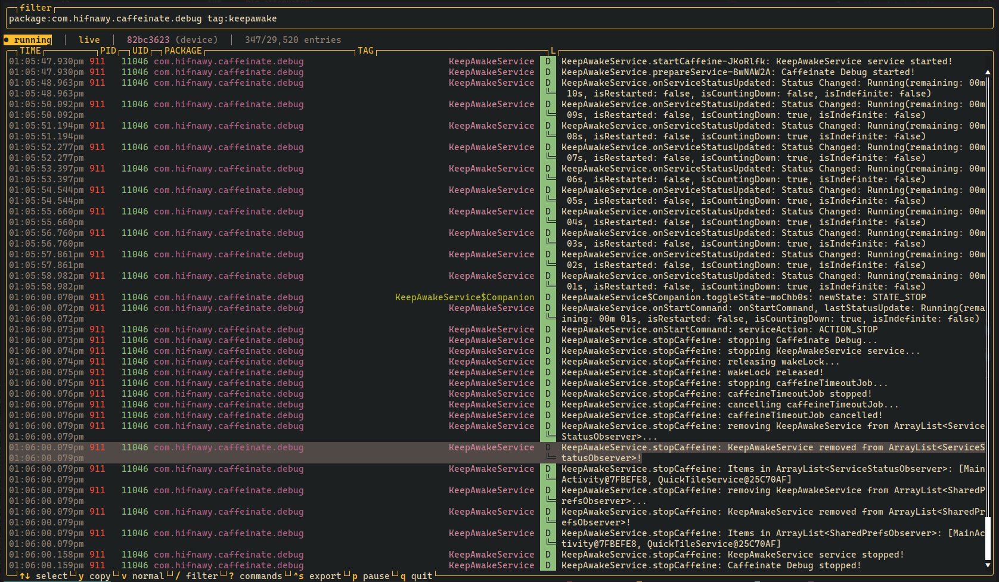
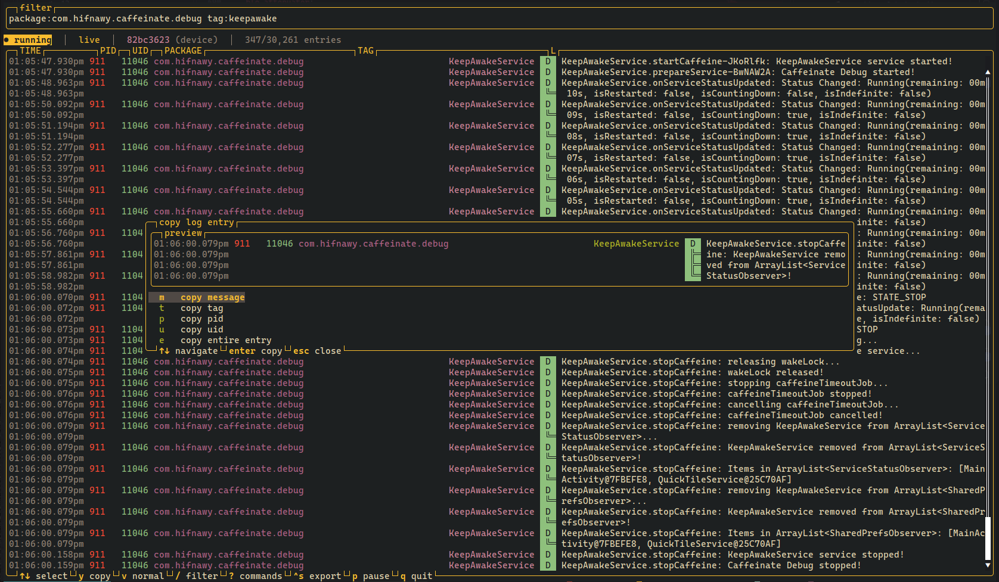
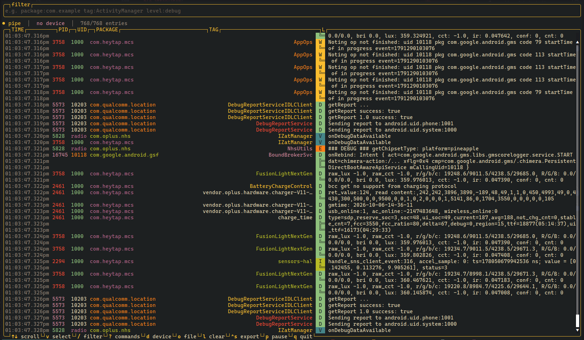
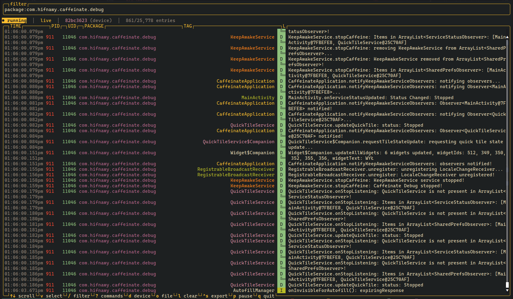

<div align="center">
   
   <h1>📃 pidcatrs</h1>
   <p>A colorized Android logcat viewer with an interactive TUI, themes, and advanced filtering</p>

[](LICENSE.md)
[](https://rust-lang.org)

<!-- [](https://winstall.app/apps/AbdElMoniemElHifnawy.pidcatrs) -->

[](https://github.com/abdalmoniem/pidcatrs)
[](https://github.com/abdalmoniem/pidcatrs/releases/latest)
[](https://github.com/abdalmoniem/pidcatrs/releases/latest)

</div>

# 🎯 Overview

A fork of [PidCat](https://github.com/JakeWharton/pidcat) re-written entirely in [Rust](https://rust-lang.org).

[PidCat](https://github.com/JakeWharton/pidcat) was originally created by Jake Wharton for the Android Open Source Project. **pidcatrs** extends that idea with a full-screen terminal UI, documented TOML configuration and color themes, multiple adb log formats (including multiline `long` output), timestamps, and the same package/tag filtering workflow you expect from classic pidcat—plus plain streaming mode when stdout is not a TTY or when you pass `--plain`.

pidcatrs filters logcat output by application package name, colorizes logs for readability, and offers CLI flags and an in-TUI filter bar so you can focus on the lines that matter.

---

# 📸 Screenshots

<div align="center">

<table>
  <tr>
    <td align="center" width="33%"></td>
    <td align="center" width="33%"></td>
    <td align="center" width="33%"></td>
  </tr>

  <tr>
    <td align="center" width="33%"></td>
    <td align="center" width="33%"></td>
    <td align="center" width="33%"></td>
  </tr>

  <tr>
    <td align="center" width="33%"></td>
    <td align="center" width="33%"></td>
    <td align="center" width="33%"></td>
  </tr>
</table>

</div>

---

# ✨ Features

- ## Modes

  - **Interactive TUI** — Default when stdout is a terminal: scroll, pause, filter, pick devices, open files, export, clipboard copy.
  - **Plain stream mode** — `--plain`, or automatic when stdout is piped or redirected (same filters and colors as classic pidcat-style output).

- ## Core filtering

  - **Package filtering** — One or more package names; process suffixes (`com.app:remote`, `com.app:`) supported.
  - **Tag filtering** — Substring matching by default; regex when you use regex syntax in patterns.
  - **Ignore tags** — `-i` / config `ignore_tags`; optional **ignore known system tags** (`-I`).
  - **Log level** — Minimum level `-l` / `level:` in the TUI filter bar.
  - **Message regex** — `-r` for line-body filtering.
  - **Current app** — `--current` resolves foreground package(s) via adb.
  - **Process tracking** — Start/death notifications for filtered processes.

- ## Formatting and adb

  - **Log formats** — `-f` / `--log-format`: `brief`, `long`, `process`, `raw`, `tag`, `thread`, `threadtime`, `time` (short aliases supported).
  - **Timestamps** — `-T` / `--timestamps` and `-Z` / `--timestamp-format` (chrono strftime).
  - **Columns** — Show PID (`-P`), UID (`-U`), package (`-p`); widths `-x` (pid/uid), `-m` (package), `-n` (tag); always show tags (`-S`).
  - **Custom adb path** — `-A` / `--adb`.
  - **Device selection** — `-d`, `-e`, `-s SERIAL` (TUI can switch devices with `d`).

- ## Configuration and themes

  - **Config file** — `~/.config/pidcatrs/config.toml` (or platform equivalent); JSON Schema in `schemas/config.schema.json`.
  - **218 bundled color themes** — Installed under `~/.config/pidcatrs/themes/`; default theme `gruber-darker`; custom `.toml` themes supported.
  - **CLI helpers** — `--print-config`, `--print-theme`, `--list-themes`, `--config`, `--theme`.
  - **Shell completions** — `--completions bash|zsh|fish|powershell|elvish`.

- ## Output

  - **Save to file** — `-o` / `--output`.
  - **Colors** — Theme-driven TUI and plain colors; `-N` / `--no-color`; optional GC highlighting `-g` / `--gc-color`.
  - **Cross-platform color** — VT100/ANSI on Windows, Linux, and macOS.

---

# 📥 Installation

- ### Installer binaries

  [](https://github.com/abdalmoniem/pidcatrs/releases/latest)
  <!-- [](https://winstall.app/apps/AbdElMoniemElHifnawy.pidcatrs) -->

- ## From source

  - ### Prerequisites

    - [Android SDK platform-tools](https://developer.android.com/tools/releases/platform-tools#downloads) with `adb` on `PATH`
    - [Rust](https://rust-lang.org/learn/get-started) (see `rust-toolchain.toml`)
    - [just](https://github.com/casey/just) (recommended) or `cargo` + `cargo xtask`
    - [Inno Setup](https://jrsoftware.org/isdl.php) — Windows installer only

  - ### Quick build

    ```bash
    git clone https://github.com/abdalmoniem/pidcatrs.git
    cd pidcatrs

    # Debug binary (fmt, clippy, schema/themes generation, build)
    just build

    # Release binary
    just build-release

    # Install release binary to PATH (non-Windows: cargo install style via xtask)
    just install
    ```

  - ### Run without installing

    ```bash
    just run 'com.example.app'
    just run-release '--plain com.example.app'
    ```

---

# 🚀 Usage

- ## TUI vs plain

  - With a connected device and a TTY stdout, **pidcatrs starts the TUI** automatically.
  - Use **`--plain`** for traditional scrolling line output (scripts, CI, or copying from a terminal without full-screen UI).
  - Redirecting stdout (e.g. `pidcatrs … | tee log.txt`) also selects plain mode.

- ## Basic usage

```bash
# TUI: filter logs by package name
pidcatrs com.example.myapp

# Multiple packages
pidcatrs com.example.app1 com.example.app2

# Plain stream
pidcatrs --plain com.example.myapp

# All packages
pidcatrs -a

# Foreground app only
pidcatrs --current
```

- ## Advanced filtering

```bash
# Tags (repeat or comma-separated)
pidcatrs com.example.app -t MyTag -t AnotherTag
pidcatrs com.example.app -t MyTag,AnotherTag

# Substring tag match
pidcatrs com.example.app -t Timeout

# Level and ignored tags
pidcatrs com.example.app -l D -i Chatty -i Verbose

# Message regex
pidcatrs com.example.app -r "Exception|FATAL"

# Regex tag patterns
pidcatrs com.example.app -t "^Network.*"
```

- ## Command line options

  Positional **`PACKAGE`** — Application package name(s); may be repeated. On the command line, packages **replace** the `packages` list in config.

  | Option | Description |
  | --- | --- |
  | `-h`, `--help` | Show help and exit |
  | `-v`, `--version` | Show version and exit |
  | `--completions SHELL` | Write shell completions to stdout |
  | `-A`, `--adb ADB_PATH` | Path to `adb` if not on `PATH` |

  **Device**

  | Option | Description |
  | --- | --- |
  | `-d`, `--device` | First physical device |
  | `-e`, `--emulator` | First emulator |
  | `-s`, `--serial SERIAL` | Specific device serial |

  **Filtering**

  | Option | Description |
  | --- | --- |
  | `-a`, `--all` | All packages (no package filter) |
  | `-k`, `--keep` | Do not clear logcat before tailing |
  | `-c`, `--current` | Filter to current foreground app(s) |
  | `-I`, `--ignore-system-tags` | Ignore built-in system tag list (combine with `-i`) |
  | `-t`, `--tag TAG` | Include tag(s); repeat or comma-separated |
  | `-i`, `--ignore-tag TAG` | Exclude tag(s); repeat or comma-separated |
  | `-l`, `--log-level LEVEL` | Minimum level: `V` `D` `I` `W` `E` `F` (case insensitive) |
  | `-r`, `--regex REGEX` | Filter log message body |

  **Formatting**

  | Option | Description |
  | --- | --- |
  | `-T`, `--timestamps` | Show timestamp column |
  | `-Z`, `--timestamp-format FMT` | chrono strftime format (default `%I:%M:%S%.3f%P`) |
  | `-f`, `--log-format FORMAT` | adb format: brief, long, process, raw, tag, thread, threadtime, time |
  | `-P`, `--show-pid` | Show PID column |
  | `-U`, `--show-uid` | Show UID column |
  | `-p`, `--show-package` | Show package / process name column |
  | `-S`, `--always-show-tags` | Always show tag column |
  | `-x`, `--puid-width WIDTH` | PID/UID column width (default 5) |
  | `-m`, `--package-width WIDTH` | Package column width (default 20) |
  | `-n`, `--tag-width WIDTH` | Tag column width (default 20) |

  **Colors and output**

  | Option | Description |
  | --- | --- |
  | `-g`, `--gc-color` | Highlight GC-related messages |
  | `-N`, `--no-color` | Disable message colors |
  | `-o`, `--output FILE` | Write plain output to file |
  | `--plain` | Force plain stream mode (no TUI) |

  **Config**

  | Option | Description |
  | --- | --- |
  | `--config PATH` | Config file (default `~/.config/pidcatrs/config.toml`) |
  | `--theme NAME_OR_PATH` | Bundled theme name or path to `.toml` (default `gruber-darker`) |
  | `--list-themes` | List bundled and custom themes |
  | `--print-config` | Print effective config as documented TOML |
  | `--print-theme` | Print active theme as documented TOML |

  CLI flags override config values when both are set. See `schemas/config.schema.json` for every config key.

---

# 🖥️ TUI user guide

Press **`?`** anytime to open the **command palette** (searchable list of shortcuts). **`Esc`** closes dialogs or leaves filter editing.

- ## General

  | Keys | Action |
  | --- | --- |
  | `q`, `Ctrl+c` | Quit |
  | `?` | Open command palette |
  | `Esc` | Close dialog / stop editing filter |

- ## Log view

  | Keys | Action |
  | --- | --- |
  | `j` / `k`, `↑` / `↓`, mouse wheel | Scroll |
  | `PgUp` / `PgDn` | Scroll by page |
  | `g` / `Home` | Jump to top |
  | `G` / `End` | Jump to bottom (resume live tail) |
  | `v` | Enter select mode |

- ## Select mode

  | Keys | Action |
  | --- | --- |
  | `j` / `k`, `↑` / `↓` | Move selection |
  | `PgUp` / `PgDn` | Move by 10 entries |
  | `y`, `Enter` | Open copy menu for selected entry |
  | `v`, `Esc` | Exit select mode |

- ## Log capture

  | Keys | Action |
  | --- | --- |
  | `p`, `Space` | Pause / resume incoming logs |
  | `l` | Clear buffer and restart live logcat |
  | `d` | Open device picker |
  | `o` | Open log file (file explorer) |
  | `Ctrl+s` | Export entries matching the current filter |

- ## Filter bar

  | Keys | Action |
  | --- | --- |
  | `/` | Focus filter input |
  | `Enter` | Apply filter |
  | `←` / `→`, `Home` / `End` | Edit filter text |
  | `Backspace` / `Delete` | Edit filter text |

  **Filter syntax** (combine terms; message words match log text):

  | Syntax | Meaning |
  | --- | --- |
  | `package:com.example.app` | Filter by package (multiple allowed) |
  | `tag:MyTag` | Filter by tag |
  | `level:debug` | Minimum level (`verbose`, `debug`, `info`, …) |
  | `pid:1234` | Filter by PID |
  | `uid:10001` | Filter by UID |
  | `search terms` | Match message text |

- ## Device picker

  | Keys | Action |
  | --- | --- |
  | `Enter` | Select highlighted device |
  | `Ctrl+r` | Refresh device list |
  | `j` / `k`, `↑` / `↓` | Move selection |

- ## Copy menu

  | Keys | Action |
  | --- | --- |
  | `m` / `t` / `p` / `u` / `e` | Copy message, tag, pid, uid, or full entry |
  | `Enter` | Copy highlighted option |
  | `j` / `k`, `↑` / `↓` | Move selection |

- ## Export format

  | Keys | Action |
  | --- | --- |
  | `p` / `a` | Export as rendered output vs raw adb lines |
  | `Enter` | Confirm format |
  | `j` / `k`, `↑` / `↓` | Move selection |

- ## File explorer

  | Keys | Action |
  | --- | --- |
  | Type a path | List matching directory entries |
  | `↑` / `↓`, `PgUp` / `PgDn` | Move selection |
  | `Tab` | Complete path with selected entry |
  | `Enter` | Open file or save export (confirm twice to overwrite) |

---

# 📚 Examples

<details>

<summary>Example 1: Basic package filtering</summary>

```bash
pidcatrs com.example.myapp
```

Opens the TUI (or plain stream if stdout is not a TTY) for `com.example.myapp`.

</details>

<details>

<summary>Example 2: Multiple tags with custom column widths</summary>

```bash
pidcatrs com.example.myapp -t Network -t Database -m 25 -n 30
```

Filters tags containing `Network` or `Database`; package column 25 chars, tag column 30 chars.

</details>

<details>

<summary>Example 3: Debug level and above</summary>

```bash
pidcatrs com.example.myapp -l D
```

Shows Debug, Info, Warning, Error, and Fatal (hides Verbose).

</details>

<details>

<summary>Example 4: Save to file without colors</summary>

```bash
pidcatrs com.example.myapp -o logs.txt -N --plain
```

Writes plain, uncolored lines to `logs.txt`.

</details>

<details>

<summary>Example 5: Current app with specific tags</summary>

```bash
pidcatrs --current -t MainActivity -t ServiceManager -S
```

Monitors the foreground app and always shows tag names for matching tags.

</details>

<details>

<summary>Example 6: Long log format with timestamps</summary>

```bash
pidcatrs --plain -f long -T com.example.myapp
```

Uses adb `long` format (multiline messages) with a timestamp column in plain mode.

</details>

<details>

<summary>Example 7: Config and theme</summary>

```bash
pidcatrs --print-config > ~/.config/pidcatrs/config.toml
pidcatrs --list-themes
pidcatrs --theme catppuccin-mocha com.example.app
```

Print a documented config template, list themes, and run with a bundled theme.

</details>

<details>

<summary>Example 8: Shell completions</summary>

```bash
pidcatrs --completions zsh > "${fpath[1]}/_pidcatrs"
```

Generate zsh completions (adjust path for your setup).

</details>

---

# 🔨 Building from source

- ## Prerequisites

  - Android SDK platform-tools (`adb` on `PATH`)
  - Rust toolchain from `rust-toolchain.toml`
  - `just` (see [Justfile](Justfile)) or invoke `cargo xtask` directly
  - Inno Setup — only for `just build-installer` on Windows

- ## Build steps

  ```bash
  just build              # debug
  just build-release      # release
  just test               # workspace tests
  just generate-schema    # refresh schemas/config.schema.json
  just generate-themes    # refresh bundled theme sources
  ```

  - ### Windows installer:

    ```bash
    just build-installer
    # Output: build/setup/Output/pidcatrs_v<version>_<datetime>.exe
    ```

  - ### Binaries:

    `target/debug/pidcatrs` or `target/release/pidcatrs` (`.exe` on Windows).

---

# ⚙️ Configuration

- ## Files

  - **Config**: `~/.config/pidcatrs/config.toml` (Linux/macOS) or `%APPDATA%\pidcatrs\config.toml` (Windows).
  - **Themes**: `themes/` next to the config file; bundled themes are copied on first run.
  - **Schemas**: [`schemas/config.schema.json`](schemas/config.schema.json), [`schemas/theme.schema.json`](schemas/theme.schema.json) for editor validation.

  On first run, if no config exists, pidcatrs can write a default file from built-in defaults. Use `--print-config` to dump the effective settings as a documented template.

- ## Tag filtering behavior

  By default, tag filters use **substring matching**:

  ```bash
  -t Timeout
  ```

  Matches tags containing `Timeout` (`TimeoutJob`, `NetworkTimeout`, …). Use regex metacharacters for exact or pattern matches:

  ```bash
  -t "^TimeoutJob$"
  -t "Timeout.*Job"
  ```

- ## Column widths

  ```bash
  pidcatrs com.example.app -m 25 -n 30 -x 6
  ```

  Package width `-m`, tag width `-n`, PID/UID width `-x`. Longer names are truncated.

- ## Colors

  Plain and TUI colors come from the active **theme** TOML (log levels, tags, packages, UI chrome). Tags and packages receive stable colors from an LRU palette; common Android tags have predefined colors in many themes.

---

# 🤝 Contributing

Contributions are welcome! Here's how you can help:

- ## Fork the repository
- ## Create a feature branch
  ```bash
  git checkout -b feature/amazing-feature
  ```
- ## Commit your changes
  ```bash
  git commit -m 'Add some amazing feature'
  ```
- ## Push to the branch
  ```bash
  git push origin feature/amazing-feature
  ```
- ## Open a Pull Request

- ## Development guidelines

  - Run `just build` or `just lint` before submitting
  - Add comments for non-obvious logic
  - Test on your target OS (Windows, Linux, macOS)
  - Update README and schemas when adding flags or config keys

---

# 📄 License

This project is licensed under the GNU General Public License 3.0 - see the [LICENSE](LICENSE.md) file for details.

---

# 🙏 Credits

- ## Original author

  - **[Jake Wharton](https://github.com/JakeWharton)** — Original [PidCat](https://github.com/JakeWharton/pidcat) creator

- ## Fork maintainer

  - **AbdElMoniem ElHifnawy** — Rust rewrite, TUI, themes, and cross-platform enhancements
  - GitHub: [@abdalmoniem](https://github.com/abdalmoniem)
  - Website: [abdalmoniem-alhifnawy.is-a.dev](https://abdalmoniem-alhifnawy.is-a.dev)

- ## Contributors

  Thanks to everyone who has helped improve pidcatrs!

---

<div align="center">

**Made with ❤️ for Android developers**

If you find pidcatrs useful, please ⭐ star the repository!

</div>
